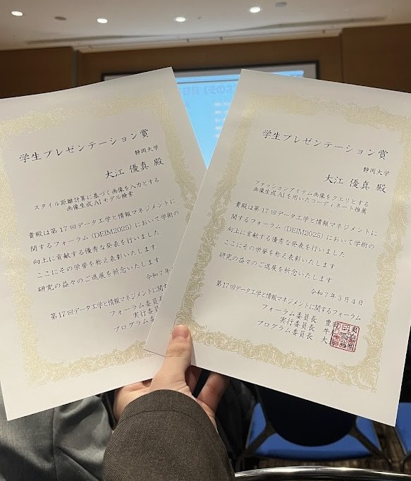

2025年2月27日から3月4日に掛けておこなわれたDEIM2025（第17回データ工学と情報マネジメントに関するフォーラム）にて、2件の研究発表をおこないました。2月27日から3月1日まではオンラインで、3月3日と3月4日はオンサイトで開催されました。今年のオンサイト会場は福岡です。

オンライン発表では、持ち時間20分のプレゼンテーションをZOOM上でおこないました。各発表は研究内容ごとに分割されたセッション別でおこなわれました。私の発表は初日の朝1と2日目の夕方でした。

オンサイトでは、A0サイズのポスターを持ち寄って研究発表をしました。私は2件発表したため、ポスターも2つ作っています。
数あるポスターの中から自分のポスターの前で足を止めていただけるよう、かなりビビッドな色使いをしました。
ポスターカラーに合わせて、この日のために仕立てたリメイク服も身に着けて気合十分。
1件目は、自分の研究のメインである「画像生成AIを用いたコーディネート推薦」に関する発表です。
昨年度のDEIMでお会いした方や、私の研究をDEIMのWebサイトで知って見に来てくださった方など、想像以上にたくさんの人に見に来て頂きました。

二件目の発表は、昨年卒業した留学生と、兵庫県立大の方々との共同研究となる「画像生成AIモデル検索」に関するものです。
「画像生成」の魅力を伝えるために、教員の顔写真をお借りしてかなりキャッチ―なポスターを作成しました。
本研究は今年奈良で開催された国際会議「MMM2025」にも採択されたものとなります。

オンサイト最終日では、オンラインセッションで優れた研究発表をおこなった学生に与えられる「学生プレゼンテーション賞」の授賞式がありました。
大変ありがたいことに、私は今回のDEIMで2件の学生プレゼンテーション賞を受賞させていただきました。
受賞に関する記事は、また別で掲載します。

学部時代の集大成となる本会議で、2件の研究発表及び2件のプレゼンテーション賞受賞という成果を残せたことを大変うれしく思います。
来年度からは大学院修士課程に進学します。更なる研究成果を世に発信するために、精進していきます。

DEIM2025の公式ホームページは[こちら](https://pub.confit.atlas.jp/ja/event/deim2025)です。

以下、本会議で発表した論文の詳細です。
* ファッションアイテム画像をクエリとする画像生成AIを用いたコーディネート推薦, 大江 優真, 莊司 慶行, 第17回データ工学と情報マネジメントに関するフォーラム（DEIM2025）会議録, pp. 1F-01, 2025.
* スタイル距離計算に基づく画像を入力とする画像生成AIモデル検索, 大江 優真, ブ・ティ・ゴッグ アン, ファム・フー・ロン, 大島 裕明, 莊司 慶行, 第17回データ工学と情報マネジメントに関するフォーラム（DEIM2025）会議録, pp. 6E-01, 2025.